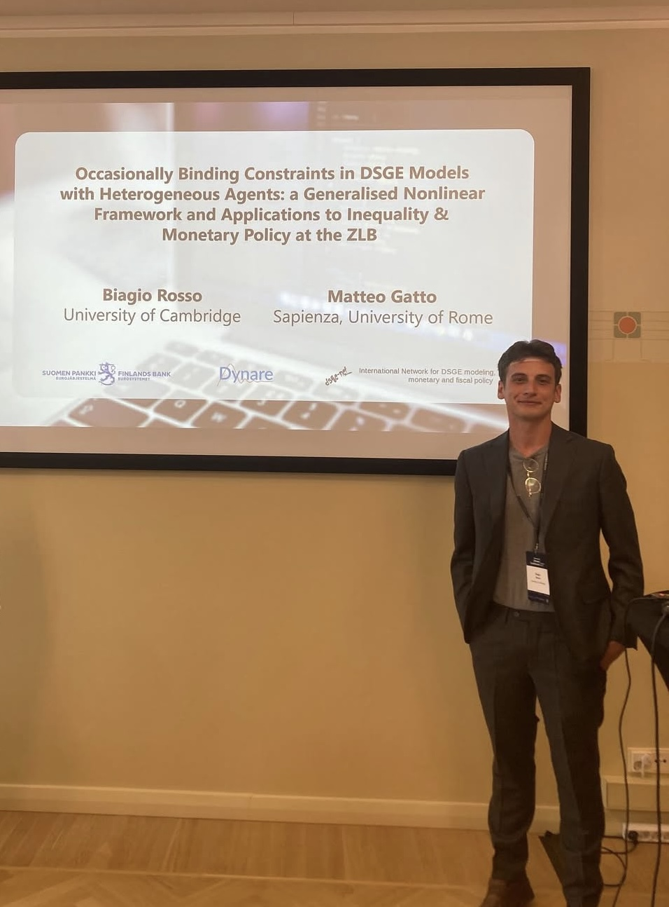

# Biagio Rosso

## About Me

I am a Ph.D. Student at the University of Cambridge, working in macroeconomics and monetary economics. My main interest and work is on theoretical DSGE modelling, DSGE and particularly HANK estimation with business cycle and empirical data, computational and solution methods in the state and sequence-space, institutional and behavioural frictions in DSGE, wealth inequality, and applications to the analysis of monetary and fiscal policy transmission and optimal design. 

- [Contact Me: br421@cam.ac.uk](mailto:br421@cam.ac.uk)
- [CV](CVwebsite.pdf)
- [RePEc Author NEP Field Listings: Macroeconomics (MAC), Monetary Economics (MON), Dynamic General Equilibrium (DGE), Central Banking     (CBA)](https://ideas.repec.org/f/pro1398.html)

After recently completing my Ph.D. internship at the Bank of England, I am joining the econ job market this fall (2025). I am particularly interested in research roles in Academia and Central Banking in any of the above areas. I would be happy to discuss any such opportunities. 

Below you will find a selection of my research output and ongoing work: please reach out if you would like the slides or a full draft of the listed works if this is signalled as available on request. Thank you for your time!

## Publications and Research Output

### Public Working Papers

    

      <h3><a href="https://mpra.ub.uni-muenchen.de/125094/1/MPRA_paper_125094.pdf"> Rosso, Biagio & Gatto, Matteo. (2024). Dynamics and         Optimal Monetary-Fiscal Policy in Fiscally Dominant Economies with Occasionally Inflexible Monetary Authorities</a></h3>
      
 MPRA Paper, University Library of Munich, Germany. 2025. Included in New Economics Papers (NEP) Reports: NEP-CBA,
      NEP-DGE, NEP-MON, NEP-MAC.

    

    

      <h3><a href="https://postkeynesian.net/media/working-papers/PKWP2511.pdf"> Rosso, Biagio & Gatto, Matteo. (2025). Occasionally         Binding Constraints in DSGE Models with Heterogeneous Agents: a Generalised Nonlinear Framework and Applications to Inequality and Monetary Policy at the ZLB.</a></h3>
      
 Post-Keynesian Economics Society (PKES) Working Paper Series, PKWP2511. Included in New Economics Papers (NEP) Reports: NEP-          CBA, NEP-DGE, NEP-MON, NEP-MAC & Conference Paper, 19th Annual DYNARE conference (Heterogeneity and Nonlinearities in                    Macroeconomics)

    

  

      <h3><a href="mailto:br421@cam.ac.uk"> Rosso, Biagio. (2025). How Financial-Institutional Structure Drives Business Cycle(s): a Semi-Structural DSGE Modelling Framework.</a></h3>
      
 Slides and full draft available on request  

    

### Journal Publications

    

      <h3><a href="http://www.accessecon.com/Pubs/EB/2025/Volume45/EB-25-V45-I2-P86.pdf"> Rosso, Biagio. (2025). Notes on inflationary         news and the equity premium puzzle in a two-asset incomplete markets model</a></h3>
      
 Economics Bulletin (EB), Vol 45 Issue 2 

    

## Current Research Work

1. Lenney, Jamie and Rosso, Biagio. (2025). Flexible Deviations from FIRE in the Sequence Space. Presented at the Bank of England MPOD research seminar.
   - [Slides available on request](mailto:br421@cam.ac.uk)

2. Rosso, Biagio. (2025). Lucas-Stokey meet Lewis: Optimal Fiscal Policy and Implicit Redistribution in a Dual Economy. 
   - [Slides, Bank of England Macro Brownbag](Rosso_DualEconomyFiscalPolicy_Slides_New.pdf)

3. Rosso, Biagio. (2025). How Financial-Institutional Structure Drives Business Cycle(s): a Semi-Structural
DSGE Modelling Framework.
  - [Slides and full fraft available on request](mailto:br421@cam.ac.uk)
   
3. Rosso, Biagio and Gatto, Matteo. (2025). The Changing Slope of the Phillips Curve: a State-Space Model and
Kalman-Filter for Estimating Dynamic Volatility in the Unobservable Slope. 
   - [Slides and advanced draft available on request](mailto:br421@cam.ac.uk)

## Connect With Me

- 📧 [Email me](mailto:br421@cam.ac.uk)
- 💡 [IDEAS/RePEc](https://ideas.repec.org/f/pro1398.html)
- 💼 [LinkedIn](https://uk.linkedin.com/in/biagio-rosso)
- 🐙 [GitHub](https://github.com/BiagioR)
- 🐦 [Bluesky](https://bsky.app/profile/biagiorosso.bsky.social)

## Affiliation
- [University of Cambridge](https://www.devstudies.cam.ac.uk/staff/biagio-rosso)
- King's College London, University of London
- Corpus Christi College, University of Cambridge
- Society of Professional Economists

## Gallery 
  

